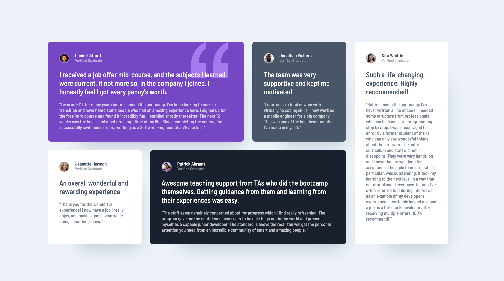

# Frontend Mentor - Testimonials grid section solution

This is a solution to the [Testimonials grid section challenge on Frontend Mentor](https://www.frontendmentor.io/challenges/testimonials-grid-section-Nnw6J7Un7). Frontend Mentor challenges help you improve your coding skills by building realistic projects. 

### The challenge

Users should be able to:

- View the optimal layout for the site depending on their device's screen size

### Screenshot

### Links

- Solution URL: [Github](https://github.com/sqle157/testimonials-grid-section)
- Live Site URL: [Live Demo](https://sqle157.github.io/testimonials-grid-section)

### Built with

- Semantic HTML5 markup
- CSS custom properties
- Grid
- Mobile-first workflow

### What I learned

In this challenge, I learned more about the grid layout and how to apply it to the challenge. This solution is mostly affected by Kevin Powell's solution, and I hope I can write my own code for grid layout in my next challenge after this one.

### Useful resources

- [Kevin Powell's Youtube Video](https://www.youtube.com/watch?v=rg7Fvvl3taU)

## Author
- Website - [Sang Le](https://github.com/sqle157)
- Frontend Mentor - [@sqle157](https://www.frontendmentor.io/profile/sqle157)